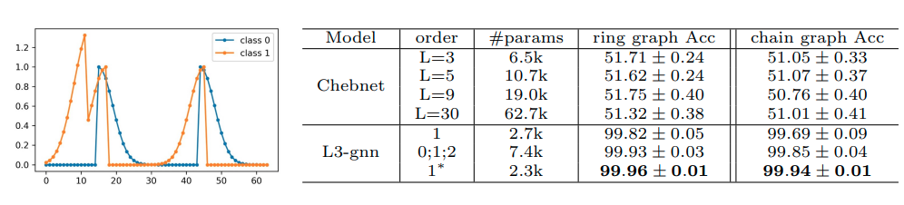

# Graph Neural Networks with Low-rank Learnable Local Filters 
<font size=4>This repo is code for the toy example 'up/down wind' in section 3 of our paper: **Graph Neural Networks with Low-rank Learnable Local Filters** [(paper link)](https://arxiv.org/abs/2008.01818)

This toy example aims to show our l3gnn's expressiveness of extract discriminative features on graph to classify 'up wind' pattern against 'down wind' pattern.</font>


## Requirements
pytorch==1.3.1

numpy==1.18.1

## Usage
### Create 'Up/Down Wind' dataset
```python
## generate ring graph data
python gen_data.py ring
## generate chain graph data
python gen_data.py chain
```

This will create dataset with indicated type of graph, with 5000 'Up Wind' randomly generated samples and 5000 'Down Wind' samples.

### Run experiment with 2-layer model
```python
## ChebNet with L=30, on chain graph data
python train.py 2 chain --gcn_type ChebNet --L 30
## L3-gnn with order 0,1,2, on chain graph data
python train.py 2 chain --gcn_type GCN_Bases --order_list 0 1 2
## L3-gnn with order 1, shared bases, on chain graph data
python train.py 2 chain --gcn_type GCN_Bases --order_list 1 --use_shared_bases
```
### Run experiment 1-layer model
```python
## L3-gnn with order 0,1,2, on chain graph data
python train.py 1 chain --gcn_type GCN_Bases --order_list 0 1 2
```